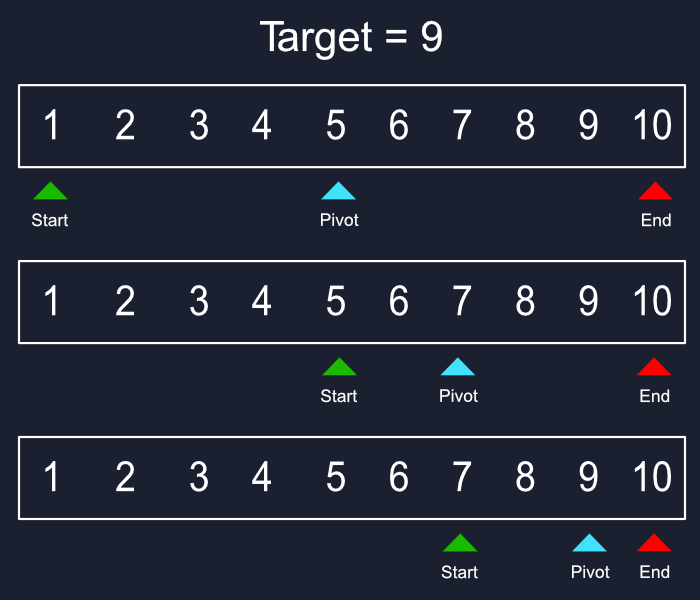

# Busca binária

A busca binária compara o elemento alvo com o elemento do meio da lista. Se eles não coincidirem, a metade na qual o elemento alvo não pode estar é eliminada e a busca continua na outra metade até que o elemento alvo seja encontrado ou que a sublista se reduza a zero.

Seu tempo de funcionamento é O(log n), onde n é o número de elementos no array.

