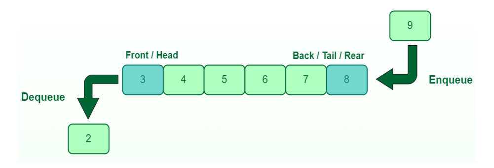

# Lista ADT

A lista é uma estrutura de dados com os mesmos métodos da pilha, porém segue a lógica FIFO (First-In, First-Out), na qual o primeiro elemento inserido é o primeiro a ser removido.  

Cada elemento é um nó que contém um valor e um ponteiro para o próximo nó na sequência, ou seja, sempre é adicionado um elemento na frente da lista. 

