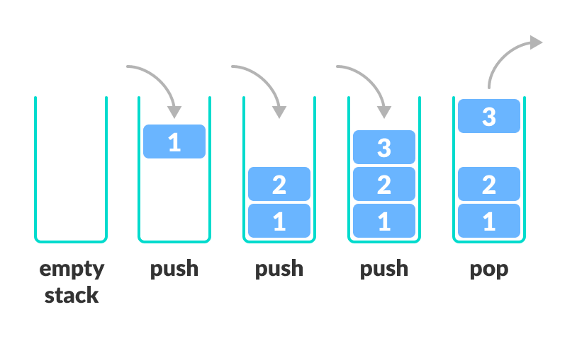

# Pilha ADT

Uma pilha é uma estrutura de dados que permite que o último elemento a entrar é o primeiro a sair da estrutura, seguindo a regra LIFO (Last in, First out). 

As principais ações de uma pilha são push (inserir) e pop (retirar), além de imprimir o topo da pilha, verificar se está cheia ou vazia e redefini-lá por completo. Assim, em C, é necessário criar uma struct com um array e um int, o array representará a pilha e o int o index do topo.

